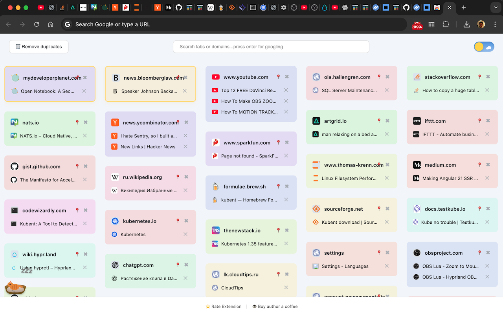
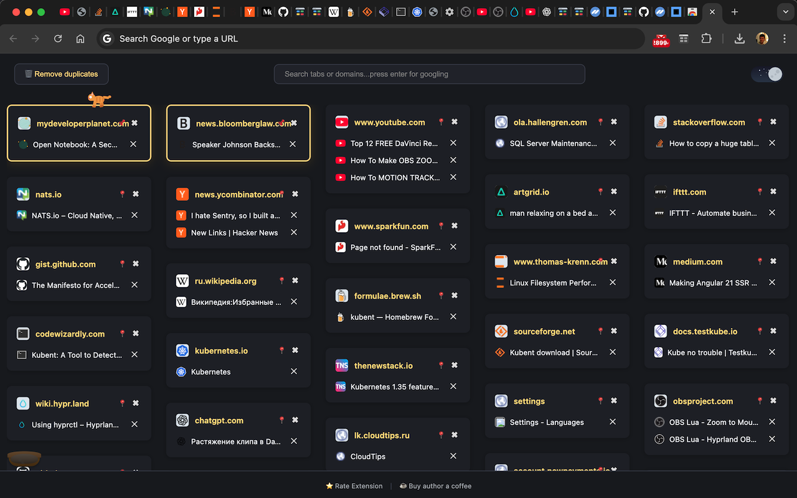

# Smart Tabs Chrome Extension

Smart Tabs is a Chrome extension that transforms your new tab page into a powerful dashboard for managing and navigating your open browser tabs. It automatically groups your tabs by domain, making it easy to find, switch, and close tabs, especially when you have many open at once.



## Features

- **Grouped Tabs by Domain:** Automatically organizes all your open tabs into visually distinct groups based on their website domain.
- **Search Tabs:** Quickly filter and find tabs by title, URL, or domain using the search bar at the top.
- **Pin Tab Groups:** Pin your most important domain groups to keep them at the top for easy access.
- **One-Click Tab Switching:** Click any tab in the dashboard to instantly switch to it.
- **Close Tabs Easily:** Close any tab directly from the dashboard with a single click.
- **Remove Duplicates:** Quickly remove duplicate tabs with one click.
- **Dark Mode:** Toggle between light and dark themes.
- **Visual Speed Dial:** Enjoy a clean, masonry-style layout with favicons and color-coded groups for quick visual navigation.
- **Responsive Design:** Works well on various screen sizes.

## Installation

To install and run Smart Tabs locally, follow these steps:

1. Clone this repository: 

   ```bash
   git clone https://github.com/nrukavkov/smart-tabs.git
   ```
2. Navigate to project directory: 

   ```
   cd smart-tabs
   ```
4. Install the dependencies using npm: 
   ```
   npm install
   ```

## For developers

To build and import Chrome Extension to Chrome browser, follow these steps:

1. Clone this repository: 

   ```bash
   git clone https://github.com/nrukavkov/smart-tabs.git
   ```

2. Navigate to project directory: 

   ```
   cd smart-tabs
   ```

3. Install the dependencies using npm: 
   ```
   npm install
   ```

4. Build the project:

   ```
   npm run build
   ```
   `This will run prep and export to create new folder 'out/', and rename '_next' folder to 'next' (without underscore)`

5. Open Google Chrome and go to chrome://extensions.

6. Enable the "Developer mode" toggle switch.

7. Click on "Load unpacked" and select the out folder generated by the build process.

8. Smart Tabs should now be loaded as an unpacked extension in Google Chrome.



## Permissions

- **tabs:** To read and manage your open tabs for grouping, searching, and switching.

## Project Structure

```
smart-tabs/
├── components/          # React components
│   ├── Footer/         # Footer component
│   ├── Header/         # Header with theme toggle and remove duplicates
│   ├── Index/          # Main page component
│   ├── SearchInput/    # Search input component
│   ├── SpeedDial/      # Masonry layout container
│   ├── TabGroup/       # Domain group component
│   └── TabItem/        # Individual tab component
├── pages/              # Next.js pages
│   ├── _app.js        # App wrapper
│   └── index.js       # Main page
├── public/             # Static files for extension
│   ├── icons/         # Extension icons
│   └── manifest.json  # Chrome extension manifest
├── styles/             # CSS modules
│   ├── globals.css    # Global styles
│   └── Pages.module.css
├── out.js             # Build script for Chrome extension
├── next.config.js     # Next.js configuration
└── package.json       # Project dependencies
```

## Privacy

Smart Tabs does not collect or transmit any personal data. All tab information is processed locally in your browser.

## Contributing

Contributions to Smart Tabs are welcome! If you find any issues or have suggestions for improvements, please feel free to open an issue or submit a pull request.

## License

MIT License. See [LICENSE](LICENSE) for details.
